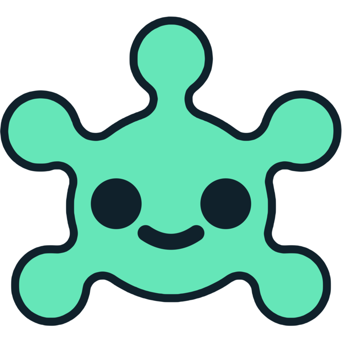
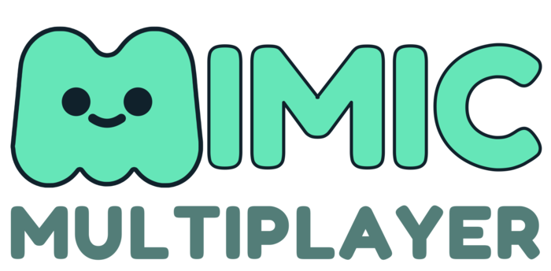

#  Mimic Multiplayer

<picture>
  <source srcset="brand/logo/mimic_m_multiplayer.svg" type="image/svg+xml">
  
</picture>

Clone-and-play multiplayer for Godot. Drop in a MimicSync node and make your scenes network-aware, with high-level nodes for connection and gameplay.

Mimic Multiplayer is currently a small connection and configuration addon for Godot 4. It manages a `Mimic` autoload, exposes typed Project Settings, starts ENet and WebSocket peers, reserves `MimicConnector` for connection UI, and provides `MimicSync` for scene-level authoring.

This project is intentionally smaller than full networking frameworks. Mimic is for developers who want a lightweight helper around Godot's built-in high-level multiplayer API, not a prediction, rollback, interpolation, lag compensation, relay, or full gameplay framework.

## Contents

- [Current Scope](#current-scope)
- [Requirements](#requirements)
- [Installation](#installation)
- [Configure Connection Defaults](#configure-connection-defaults)
- [Start Networking From Code](#start-networking-from-code)
- [Listen For Connection Events](#listen-for-connection-events)
- [Use MimicConnector](#use-mimicconnector)
- [Use MimicSync](#use-mimicsync)
- [Logging](#logging)
- [Mimic Or NetFox?](#mimic-or-netfox)
- [Current Limitations](#current-limitations)
- [Minimal Local Test](#minimal-local-test)
- [Regression Testing And Automation](#regression-testing-and-automation)
- [Editor Multi-Instance Testing](#editor-multi-instance-testing)

## Compatibility Policy

Mimic keeps the current project shape explicit instead of carrying compatibility layers for older names, behavior, files, scenes, or configuration. After updating Mimic, review your code, scenes, and Project Settings > Mimic Multiplayer against this README and update them to the current model.

## Current Scope

Mimic is focused on connection setup, project configuration, and a stable visible component shape.

Working now:

- Plugin-managed `Mimic` singleton.
- Project Settings for connection defaults.
- ENet server/client startup.
- WebSocket server/client startup.
- Offline state and an Offline transport selection that intentionally does not start a network peer.
- WebRTC transport selection reserved for future signaling support, currently unsupported.
- Optional UPnP port forwarding.
- Runtime connection state, status helpers, and lifecycle signals.
- Project Settings auto-connect for startup scenes and local multi-instance testing.
- `MimicConnector` placeholder for future connection form UI.
- `MimicSync` component that subclasses Godot's `MultiplayerSynchronizer`.

Not ready yet:

- Automatic dynamic spawn/despawn replication.
- Late-join spawn replay or spawn-state transfer from `SceneReplicationConfig` spawn properties.
- Built-in connector UI controls.
- Prediction, rollback, interpolation, lag compensation, matchmaking, relay services, or raw packet protocols.

## Requirements

- Godot 4.6 or newer.
- A project using Godot's high-level multiplayer API.

## Installation

Copy the addon into your project:

```text
res://addons/mimic/
```

The scripts developers usually add to scenes live in:

```text
res://addons/mimic/nodes/
```

Enable the plugin:

1. Open Project > Project Settings.
2. Go to the Plugins tab.
3. Enable `Mimic`.

When enabled, the plugin adds a `Mimic` singleton so your scripts can call `Mimic.start_server()`, `Mimic.start_client()`, and related helpers.

## Configure Connection Defaults

Open Project > Project Settings and search for `Mimic Multiplayer`.

Godot does not currently expose a description field for custom Project Settings added through `ProjectSettings.add_property_info()`, so Mimic documents setting meanings here instead of relying on tooltips.

Connection:

```text
mimic_multiplayer/connection/transport: Offline, ENet, WebSocket, or WebRTC (Unsupported)
mimic_multiplayer/connection/editor_auto_connect: Disabled, Server Then Client, Client, or Server
mimic_multiplayer/connection/address: Client address, default 127.0.0.1
mimic_multiplayer/connection/port: Server/client port, default 15490
mimic_multiplayer/connection/max_clients: Max ENet server clients, default 32
```

WebSocket:

```text
mimic_multiplayer/websocket/client_use_tls: Use wss:// when joining a WebSocket server, default false
```

Port Forwarding:

```text
mimic_multiplayer/port_forwarding/enabled: Try UPnP port forwarding when hosting, default false
```

Advanced settings are hidden unless Advanced Settings is enabled in Project Settings.

Advanced connection settings:

```text
mimic_multiplayer/connection/bind_address: Local bind address for server sockets and ENet client local binding, default *
```

Advanced ENet settings:

```text
mimic_multiplayer/enet/channel_count: ENet channel count, default 0
mimic_multiplayer/enet/in_bandwidth: Incoming bandwidth limit in bytes per second, 0 for unlimited
mimic_multiplayer/enet/out_bandwidth: Outgoing bandwidth limit in bytes per second, 0 for unlimited
mimic_multiplayer/enet/client_local_port: Local ENet client port, 0 for ephemeral
```

Advanced WebSocket settings:

```text
mimic_multiplayer/websocket/path: Optional path appended to WebSocket client URLs, default empty
mimic_multiplayer/websocket/handshake_timeout: WebSocket handshake timeout in seconds, default 3.0
```

Advanced port forwarding settings:

```text
mimic_multiplayer/port_forwarding/delete_mapping_on_stop: Delete owned UPnP mappings when networking stops, default true
mimic_multiplayer/port_forwarding/query_external_address: Query the gateway external address after mapping, default true
mimic_multiplayer/port_forwarding/protocol: TCP/UDP mapping protocol selection, default Transport Default
mimic_multiplayer/port_forwarding/duration: UPnP mapping lease duration in seconds, default 7200; 0 requests permanent
mimic_multiplayer/port_forwarding/discover_timeout_ms: UPnP discovery timeout in milliseconds, default 2000
mimic_multiplayer/port_forwarding/discover_ttl: UPnP discovery time-to-live hop count, default 2
```

Debug:

```text
mimic_multiplayer/debug/log_level: All, Warning, Error, or None, default Warning
```

UPnP discovery and port mapping run in a background thread so hosting does not block the main thread while the router responds.

Port forwarding depends on the user's router, network, and platform. Treat it as a convenience for local testing, not a guaranteed matchmaking or NAT traversal solution.

## Start Networking From Code

Host a server using the Project Settings defaults:

```gdscript
var error := Mimic.start_server()
if error != OK:
	MimicLog.error("Failed to start server: %s" % error_string(error))
```

Join a server using the Project Settings defaults:

```gdscript
var error := Mimic.start_client()
if error != OK:
	MimicLog.error("Failed to start client: %s" % error_string(error))
```

Override the address or port for a single call:

```gdscript
Mimic.start_server(9000)
Mimic.start_client("192.168.1.25", 9000)
```

Stop networking:

```gdscript
Mimic.stop()
```

Cancel an in-progress client connection:

```gdscript
Mimic.cancel_connection()
```

Start as server if possible, otherwise connect as a client:

```gdscript
Mimic.start_server_or_client()
```

This is useful for quick local multi-instance testing. The first running instance usually binds the port and becomes server; later instances fail to bind and fall back to client.

Project Settings auto-connect only runs when Godot has the `editor` feature tag, so exported builds should start connections from game code or UI.

## Listen For Connection Events

Connect to Mimic signals from any script:

```gdscript
func _ready() -> void:
	Mimic.state_changed.connect(_on_state_changed)
	Mimic.start_failed.connect(_on_start_failed)
	Mimic.server_started.connect(_on_server_started)
	Mimic.client_started.connect(_on_client_started)
	Mimic.client_connected.connect(_on_client_connected)
	Mimic.client_connection_failed.connect(_on_client_connection_failed)
	Mimic.server_disconnected.connect(_on_server_disconnected)
	Mimic.peer_connected.connect(_on_peer_connected)
	Mimic.peer_disconnected.connect(_on_peer_disconnected)
	Mimic.stopped.connect(_on_stopped)
	Mimic.port_mapping_finished.connect(_on_port_mapping_finished)


func _on_state_changed(state: int, previous_state: int) -> void:
	MimicLog.log("State changed from", previous_state, "to", state)


func _on_start_failed(_attempted_state: int, error: int, message: String) -> void:
	MimicLog.warning("%s (%s)" % [message, error_string(error)])


func _on_server_started(port: int) -> void:
	MimicLog.log("Server listening on", port)


func _on_client_started(address: String, port: int) -> void:
	MimicLog.log("Connecting to %s:%d" % [address, port])


func _on_client_connected() -> void:
	MimicLog.log("Connected")


func _on_client_connection_failed(message: String) -> void:
	MimicLog.warning(message)


func _on_server_disconnected() -> void:
	MimicLog.log("Disconnected from server")


func _on_peer_connected(peer_id: int) -> void:
	MimicLog.log("Peer connected:", peer_id)


func _on_peer_disconnected(peer_id: int) -> void:
	MimicLog.log("Peer disconnected:", peer_id)


func _on_stopped() -> void:
	MimicLog.log("Networking stopped")


func _on_port_mapping_finished(result: int, external_address: String) -> void:
	MimicLog.log("Port mapping result:", result, external_address)
```

Useful state helpers:

```gdscript
Mimic.is_offline()
Mimic.is_connecting()
Mimic.is_server()
Mimic.is_client()
Mimic.get_state()
Mimic.get_local_peer_id()
Mimic.get_peer_ids()
Mimic.get_external_address()
```

## Use MimicConnector

`MimicConnector` is reserved for a future drag-and-drop connection form with an IP field, port field, Host button, Join button, and Stop button. It does not start networking on its own.

For now, wire your own UI directly to the `Mimic` singleton:

```gdscript
func _on_host_pressed() -> void:
	Mimic.start_server()


func _on_join_pressed() -> void:
	Mimic.start_client()


func _on_stop_pressed() -> void:
	Mimic.stop()
```

Use Project Settings for editor-only startup auto-connect:

```text
mimic_multiplayer/connection/editor_auto_connect = Disabled
mimic_multiplayer/connection/editor_auto_connect = Server Then Client
mimic_multiplayer/connection/editor_auto_connect = Client
mimic_multiplayer/connection/editor_auto_connect = Server
```

## Use MimicSync

Add a `MimicSync` node under a scene/entity you want to prepare for synchronization.

`MimicSync` is a `MultiplayerSynchronizer`, so configure it like Godot's native synchronizer:

1. Add `MimicSync` as a child of the node you want to sync.
2. Set or confirm its `root_path`.
3. Assign a `SceneReplicationConfig`.
4. Choose the properties Godot should replicate.

Current note: runtime property replication remains Godot's native `MultiplayerSynchronizer` behavior. Mimic does not yet replace `MultiplayerSpawner` or perform automatic dynamic spawning in the current connection MVP.

## Logging

Mimic logs connection attempts, connection results, peer changes, stop events, and UPnP results.

Set log output in Project Settings:

```text
mimic_multiplayer/debug/log_level: All, Warning, Error, None
```

Example log line:

```text
05-29 22:14:03 [Mimic 2] [mimic._on_connected_to_server] Connected to server.
```

The number inside the Mimic tag appears only in editor-launched runs, and only when a connected multiplayer peer has a valid local peer ID. The caller tag appears when GDScript call stacks are available; release exports need `debug/settings/gdscript/always_track_call_stacks` enabled to include it.

Use `MimicLog.log()`, `MimicLog.warning()`, and `MimicLog.error()` for messages that should respect `mimic_multiplayer/debug/log_level`. Use `MimicLog.log_forced()`, `MimicLog.warning_forced()`, and `MimicLog.error_forced()` for diagnostics that should always output logs.

To route formatted Mimic output yourself, set `MimicLog.output_handler`:

```gdscript
var mimic_log_messages: PackedStringArray = []


MimicLog.output_handler = func(level: MimicLog.Level, message: String) -> void:
	mimic_log_messages.append(message)
```

## Mimic Or NetFox?

Mimic and NetFox are not trying to be the same thing.

Use Mimic if you want:

- A smaller helper around Godot's built-in high-level multiplayer API.
- Basic connection setup through project settings.
- A lightweight host/join/stop workflow.
- A future path toward simpler `MultiplayerSpawner` and `MultiplayerSynchronizer` authoring.
- Fewer systems to learn before prototyping.

Use NetFox if you need:

- Consistent network timing.
- Rollback.
- Client-side prediction.
- Server reconciliation.
- Interpolation helpers.
- Lag compensation.
- Noray integration.
- A more complete networking framework for responsive online games.

NetFox is the better fit when your game needs advanced netcode features. Mimic is intentionally smaller and aims to make the common Godot multiplayer setup easier rather than replacing a full-featured framework.

## Current Limitations

- WebRTC is listed but not implemented.
- ENet is not available in web exports; use WebSocket for browser clients.
- WebSocket server TLS is not configured by Mimic yet; terminate `wss://` at a proxy.
- WebSocket subprotocols and custom handshake headers are not exposed yet.
- Mimic does not yet perform dynamic spawn/despawn replication.
- Mimic does not yet package spawn properties from `SceneReplicationConfig`.
- Mimic does not yet provide built-in UI controls.
- Mimic does not provide prediction, rollback, interpolation, lag compensation, matchmaking, or relay services.

## Minimal Local Test

1. Set `mimic_multiplayer/connection/transport` to `ENet`.
2. Set `mimic_multiplayer/connection/editor_auto_connect` to `Server Then Client`.
3. Set `mimic_multiplayer/connection/address` to `127.0.0.1`.
4. Set `mimic_multiplayer/connection/port` to `15490`.
5. Run two game instances.

Expected result:

- The first instance starts as server.
- The second instance joins as client.
- Connection events appear in the Godot output.

## Regression Testing And Automation

Mimic includes automated checks intended to keep current behavior stable as the addon evolves. These tests are regression guardrails, not a requirement to practice test-driven development before every change.

Run the full local verification pass from PowerShell:

```powershell
powershell -NoProfile -ExecutionPolicy Bypass -File tools/verify.ps1
```

This uses the repo-local Godot wrapper in `tools/godot.ps1`. By default it prefers a valid `MIMIC_GODOT_PATH`, then a valid `GODOT_PATH`, then the local Godot 4.6.3 path:

```text
C:\Programming_Files\Godot\Godot_v4.6.3-stable_win64.exe\Godot_v4.6.3-stable_win64_console.exe
```

Override the executable for one run:

```powershell
powershell -NoProfile -ExecutionPolicy Bypass -File tools/verify.ps1 -GodotPath "C:\path\to\Godot.exe"
```

The verification pass does six things:

- Imports project resources with Godot in headless mode.
- Runs GUT unit regression tests from `res://test/unit/`.
- Runs a minimal project startup probe headlessly without opening a network peer.
- Runs a two-instance ENet explicit host/client smoke test through `res://test/integration/mimic_connection_probe.tscn`.
- Runs a two-instance ENet `Server Then Client` smoke test.
- Runs a two-instance WebSocket explicit host/client smoke test.

Run just the unit tests:

```powershell
powershell -NoProfile -ExecutionPolicy Bypass -File tools/godot.ps1 --headless --path . -s res://addons/gut/gut_cmdln.gd -gconfig=res://.gutconfig.json -gexit
```

Run just the two-instance connection smoke test:

```powershell
powershell -NoProfile -ExecutionPolicy Bypass -File tools/run_two_instances.ps1 -Transport enet -ConnectMode explicit -Port 18910
powershell -NoProfile -ExecutionPolicy Bypass -File tools/run_two_instances.ps1 -Transport enet -ConnectMode server_then_client -Port 18911
powershell -NoProfile -ExecutionPolicy Bypass -File tools/run_two_instances.ps1 -Transport websocket -ConnectMode explicit -Port 18912
```

Unit tests use the vendored GUT addon in `res://addons/gut/`. Add tests when changing public Mimic behavior, fixing a bug, or touching connection/project-settings code that automated changes could easily regress later.

## Editor Multi-Instance Testing

Godot can launch multiple local game instances from the editor:

1. Open Debug > Customize Run Instances...
2. Set the number of instances you want.
3. Run the project.

For easier window tiling, add `res://addons/mimic/testing/mimic_run_instance_grid.gd` as an AutoLoad named `MimicRunInstanceGrid`.

Also disable Game > Embedding Options > Embed Game on Next Play so each instance opens in its own window. When multiple editor-launched instances start together, `MimicRunInstanceGrid` arranges them into a grid and appends their instance index to the window title.
