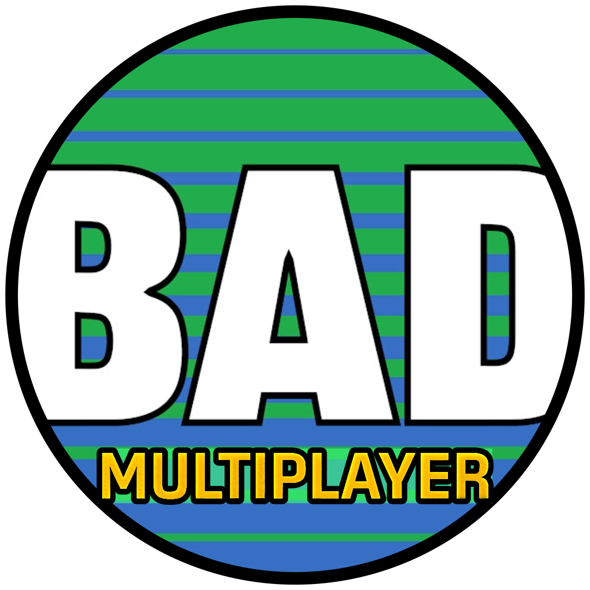

# BAD Multiplayer

[{ .addon-logo }](https://github.com/BatteryAcid/bad-multiplayer-plugin)

BAD Multiplayer is a Godot addon with a goal that overlaps with Mimic: reducing the amount of networking setup needed before you can host, join, and run a multiplayer game.

[View the BAD Multiplayer repository](https://github.com/BatteryAcid/bad-multiplayer-plugin) or [open its getting started documentation](https://github.com/BatteryAcid/bad-multiplayer-plugin/wiki/Getting-Started).

Mimic and BAD Multiplayer are both for developers who want less multiplayer ceremony, but they make different tradeoffs.

| Need | Mimic | BAD Multiplayer |
| --- | --- | --- |
| Main goal | Make Godot's high-level multiplayer setup easier to author while staying small | Minimize networking setup for match-based multiplayer games |
| Best starting point | Connection helpers, Project Settings, lifecycle signals, and `MimicSync` | Host/join entry points, network selection, scene flow, and match-action helpers |
| Game structure | Does not own your menu, loading, or gameplay scenes | Assumes a menu to loading to game flow by default |
| Gameplay layer | Avoids built-in match, score, respawn, and game-over systems | Includes match-action patterns for common match-game events |
| Godot alignment | Keeps replication close to `MultiplayerSynchronizer` and `SceneReplicationConfig` | Still uses Godot's native spawners and synchronizers in its examples |
| Transport focus | ENet and WebSocket helpers in the current Mimic MVP | ENet, Offline, and Noray-oriented ideas |

## Choose Mimic When

- You want a lightweight helper around Godot's built-in high-level multiplayer API.
- You want to keep control over your menus, scene transitions, lobby flow, and gameplay rules.
- You want simple host, join, stop, status, logging, and Project Settings workflows.
- You want a future path toward simpler replicated entity authoring without adopting a match-game framework.
- You are targeting browser clients and want WebSocket connection helpers.

## Choose BAD Multiplayer When

- Your game already fits a match-based flow with main menu, loading scene, and game scene.
- You want an addon that provides more opinionated menu, scene, and match-action structure.
- You like the idea of custom match actions for score, respawn, ready state, or game-over updates.
- You are interested in Noray-style client-host P2P ideas.
- You are comfortable adapting around its predefined managers and scene flow.

## How This Helps Mimic Users

BAD Multiplayer is useful to study because it shows another answer to the same pain: Godot multiplayer has a lot of setup before a game feels testable online. Its examples also show the parts Mimic still wants to make easier in the future: spawner placement, spawn paths, synchronized properties, peer-owned input, and server-owned gameplay objects.

Mimic intentionally stays smaller. Use Mimic when you want connection setup and native Godot replication authoring to become easier without handing scene flow or match rules to the addon.

The BAD Multiplayer icon belongs to the BAD Multiplayer project and is shown here only to identify the linked project.

