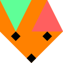

# Netfox

[{ .netfox-logo }](https://foxssake.github.io/netfox/)

Netfox is a larger Godot multiplayer addon family for responsive online games. It focuses on timing, rollback, prediction, interpolation, lag compensation, and related networking systems.

[Open the Netfox documentation](https://foxssake.github.io/netfox/) or [view the Netfox repository](https://github.com/foxssake/netfox).

Mimic and Netfox can both help Godot multiplayer projects, but they serve different needs.

| Need | Mimic | Netfox |
| --- | --- | --- |
| Main goal | Make Godot's high-level multiplayer setup easier to author | Provide a fuller online-game networking framework |
| Best starting point | Connection helpers, Project Settings, and visible scene components | Timing, rollback, prediction, interpolation, and advanced netcode nodes |
| Godot alignment | Stays close to `MultiplayerSynchronizer` and `SceneReplicationConfig` | Adds its own network model and supporting systems |
| Learning curve | Small, especially for projects already using Godot's high-level multiplayer | Larger, because it covers more netcode problems |
| Browser path | WebSocket clients through Godot exports | Depends on the Netfox stack and game architecture |

## Choose Mimic When

- You want a small helper around Godot's built-in high-level multiplayer API.
- You want simple host, join, stop, status, and Project Settings workflows.
- You are prototyping and want fewer networking systems to learn before testing a local multiplayer flow.
- You want your replicated entities to stay close to Godot's native synchronization tools.

## Choose Netfox When

- Your game needs rollback, prediction, reconciliation, interpolation, lag compensation, or network tick management.
- You want a broader networking framework instead of a small helper layer.
- You are ready to build around Netfox's nodes, timing model, and addon family.
- Your project needs Noray-style connection support or the extra reusable systems Netfox provides.

Mimic is intentionally smaller. Netfox is the better fit when the networking model itself is a central part of the game.

The Netfox icon belongs to the Netfox project and is shown here only to identify the linked project.

